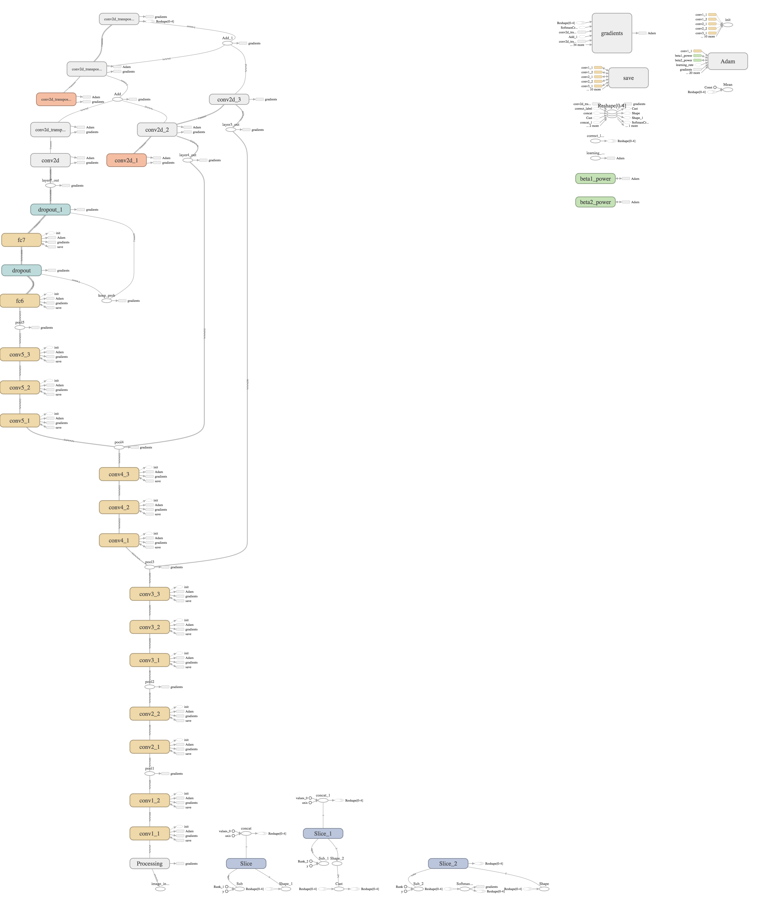
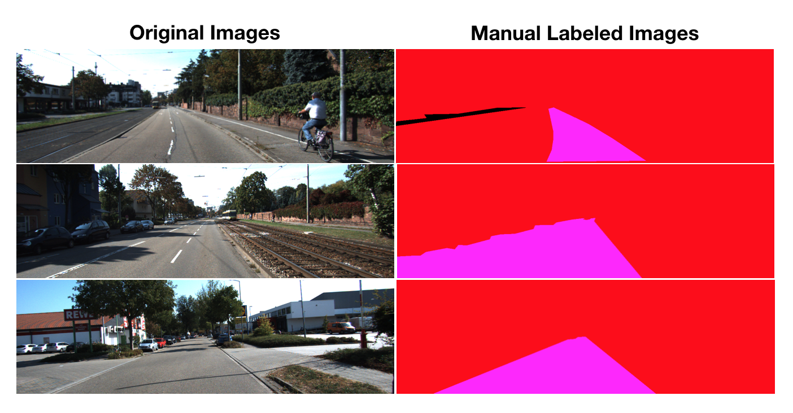

# Semantic Segmentation
### Introduction
In this project, we'll label the pixels of a road in images using a Fully Convolutional Network (FCN). 

### Network Architecture
Pre-trained VGG-16 was used to transfer learned features, and improvise architecture to FCN by adding Encoder and Decoder layers subsequently.

The approach is based on [publication](https://people.eecs.berkeley.edu/~jonlong/long_shelhamer_fcn.pdf).

Below repsentation demonstrates improvised VGG-16 Architetcure improvised to FCN.

**Encoder:**
- Layer 7 from VGG16 was supplemented with 1x1 Conv layer to preserve spatial information. This completes Encoder portion of FCN.

**Decoder:**
- Upsampling/dec-conv was added to retrive full resilution image back.

**Skip Layers:**
- Skip layers were to added to Layer 4 and Layer 3 of VGG, and subsequenty upsampling was applied to them to derive final output..

    

### Data
Kitti Road Dataset was given to train the model. Below is quick reflection of original images and manually labled images used for training.



### Optimizer & Hyperparameters
GPU is must for this training, on CPU it is feasible to run, however it would run for many hours, and any adjustments woould be quite daunting.

**Optimizer:** Adam Optimizer has been used.

**Hyperparameters:**
- Learning Rate: 1e-4
- Epochs: 50
- Batch Size: 16 (Adjust the batch size based on available memory on GPU)

### Inference drawn based on trained model..
Results were fairly as expected, i.e. about 80% accuracy.


### Optional Items .. 
There were bunch of optional items, yet to be worked .. 
- Train the same model on cityscapes-dataset at cityscapes-dataset.com
- Apply the trained model to a video 
- Infer other classes like people, signs, cars etc .. 

### Setup
##### Frameworks and Packages
Make sure you have the following is installed:
 - [Python 3](https://www.python.org/)
 - [TensorFlow](https://www.tensorflow.org/)
 - [NumPy](http://www.numpy.org/)
 - [SciPy](https://www.scipy.org/)
##### Dataset
Download the [Kitti Road dataset](http://www.cvlibs.net/datasets/kitti/eval_road.php) from [here](http://www.cvlibs.net/download.php?file=data_road.zip).  Extract the dataset in the `data` folder.  This will create the folder `data_road` with all the training a test images.

### Start
##### Implement
Implement the code in the `main.py` module indicated by the "TODO" comments.
The comments indicated with "OPTIONAL" tag are not required to complete.
##### Run
Run the following command to run the project:
```
python main.py
```
**Note** If running this in Jupyter Notebook system messages, such as those regarding test status, may appear in the terminal rather than the notebook.

### Submission
1. Ensure you've passed all the unit tests.
2. Ensure you pass all points on [the rubric](https://review.udacity.com/#!/rubrics/989/view).
3. Submit the following in a zip file.
 - `helper.py`
 - `main.py`
 - `project_tests.py`
 - Newest inference images from `runs` folder  (**all images from the most recent run**)
 
 ## How to write a README
A well written README file can enhance your project and portfolio.  Develop your abilities to create professional README files by completing [this free course](https://www.udacity.com/course/writing-readmes--ud777).
